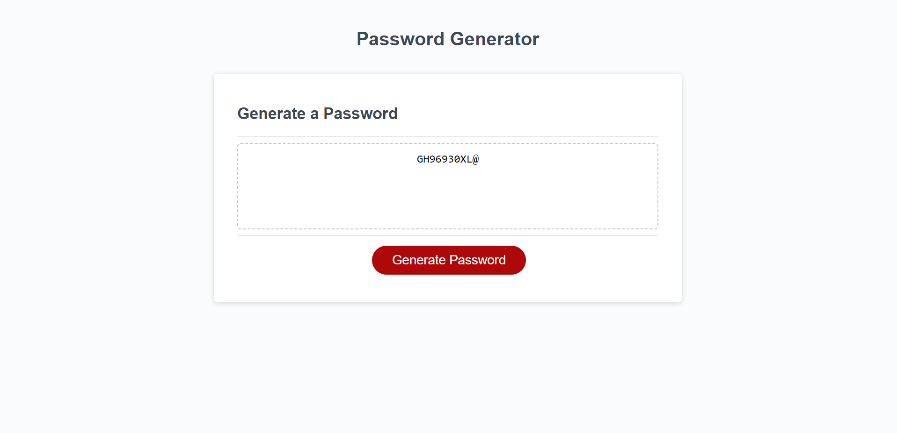

# Password Generator

## Description

This web application is designed for a quick password through prompts with various critera. There are multiple options to choose from, including Length, Special Characters, Numbers, and Capitilized letters!

## User information
Click Generate and enter your prefered criteria, then it will automatically generate a new password for you! Refresh after each password is generated for best results!
## Links

Link to Repository
https://github.com/ccoff1798/Password-Generation

Deployed Site
https://ccoff1798.github.io/Password-Generation/

## Screenshot

## Credits

This project is a solo project, with the help of my teachers in the Full stack bootcamp!
